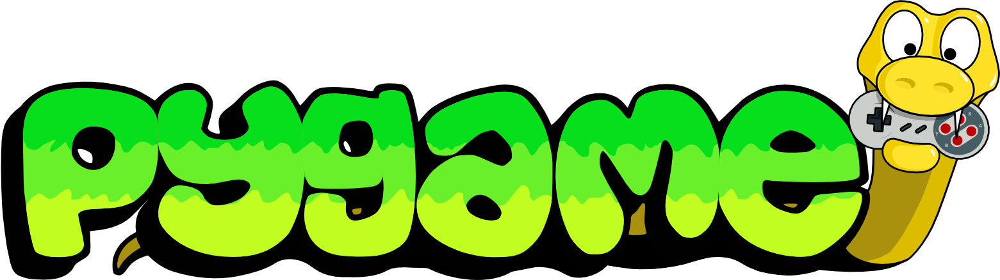

# **Yet Another Snake Game (YASG)**

A simple, yet addictive Snake Game built with Python and Pygame. The game features a classic snake eating food to grow longer while avoiding collisions with itself and the screen borders.

<p align="center">
  
</p>

This project is built using **Pygame** and packaged into an executable using **PyInstaller**. It supports Linux environments for building and running.

<p align="center">
  
  
</p>

## **Features**
- **Snake Game**: Control the snake to eat food and grow longer.
- **Game Over**: The game ends when the snake collides with the screen border or itself.
- **Score Display**: Track the current score while playing.
- **Logging**: The score and gameplay time are logged to a text file after each game session.

## **Requirements**

Before running or building the project, you need to install Python and the required dependencies.

- **Python 3.x** (Python 3.6+ recommended)
- **Pip** (Python's package manager)

## Installation

### **Automatic (building executable)**

Clone the repository and create a virtual environment:

```bash
git clone https://github.com/TheOnlyCoffeeman/YASG.git
cd YASG
make
./build/YASG #linux/mac
/build/YASG.exe #windows 
```

### **(Manual) Steps to Set Up the Virtual Environment**

1. Clone this repository:
    ```bash
    git clone https://github.com/TheOnlyCoffeeman/YASG
    cd YASG
    ```

2. Create a virtual environment:
    ```bash
    python3 -m venv venv
    ```

3. Activate the virtual environment:
    - **Linux/Mac**:
      ```bash
      source venv/bin/activate
      ```
    - **Windows**:
      ```bash
      .\venv\Scripts\activate
      ```

4. Install the required dependencies:
    ```bash
    pip install -r requirements.txt
    ```

### **Running the Game**

To run the game directly from the Python environment, use:
```bash
python main.py
